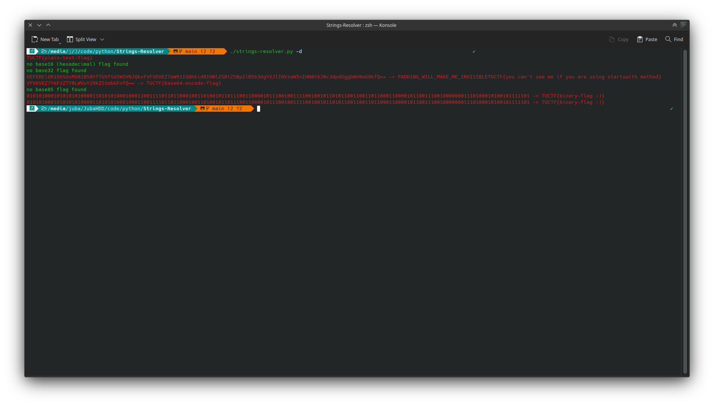
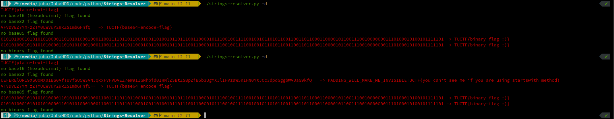

# Flagger
Search any flag format in `strings` output

## Todo List 

- [x] Search for the plain-text flag 
- [ ] Search for the bases of the flag (base64, 42, ...)
  - [x] base64 
  - [x] base45
  - [x] base16 (hex)
  - [ ] base8 (octal)
  - [x] base2 (binary)
  - [x] base32
  - [x] base85
- [x] Search for the ROT13 of the flag (ROT1, ROT2, ... ROT26)
- [x] fix not found flags (merged between text)
  - 
  