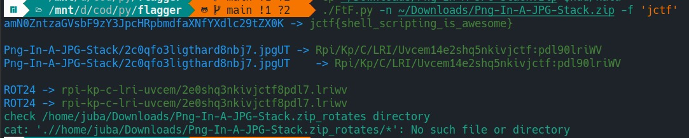
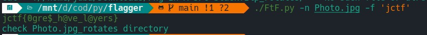
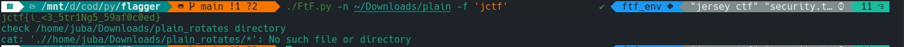

# Rorensics: Raiders Forensics

## CTF demo
### JerseyCTF
- Png In A JPG Stack Challenge

- Photo Challenge

- plain Challenge


### Crowd-Security


## Installation
```bash
pip install juba0x00-flagger
```

## Contributors ✨

Thanks goes to these wonderful people :


<table>
  <tbody>
    <tr>
      <td align="center" valign="top" width="14.28%"><a href="https://github.com/juba0x00"><br /><sub><b>Mahmoud Hawash</b></sub></a><br /><a href="#idk" title="Tutorials">✅</a></td>
      <td align="center" valign="top" width="14.28%"><a href="https://github.com/motarekk"><br /><sub><b>Mohammed Tarek</b></sub></a><br /><a href="#" title="Tutorials">✅</a></td>
      <td align="center" valign="top" width="14.28%"><a href="https://github.com/N0rhan"><br /><sub><b>Nourhan Mohamed</b></sub></a><br /><a href="#" title="Tutorials">✅</a></td>
      </tr>
  </tbody>
</table>
